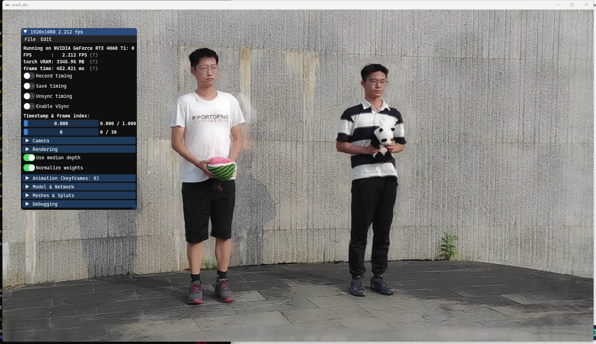
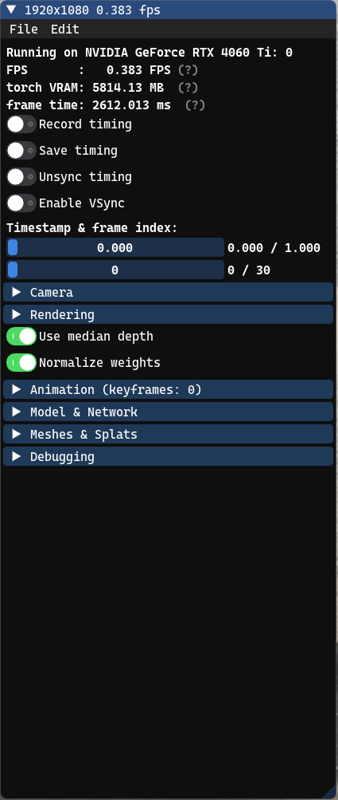
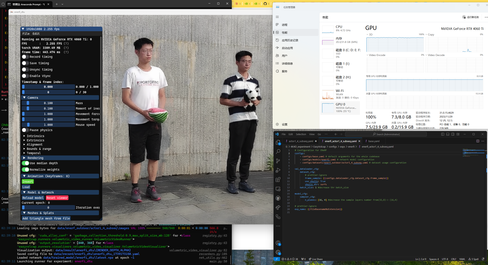

 # The summary of EasyVolcap and 4DGS
## EasyVolcap 
In one word, EasyVolcap is a __Pytorch library__ for accelerating neural volumetric video research. 

In my words, __EasyVolcap__ is a __studio__ used for __4D Model__. Why I said like this, for the related research in __3D Model__, __Nerfstudio__ is built for a simple process to finished end-to-end process of creating, training, and testing NeRFs and its related variants. The 3D model studio(Nerfstudio) is very friendly for 3D Model beginners as it modularize each component in GUI way. The users can use all kinds of functions by GUI interfaces. From the following gif, we can see the user set the specific path(red line) to view the whole 3D building model, and it can also adjust the camera view for specific users' requirements. Compared to the original Nerf model, Nerf developers have to adjust the complex path code to get output. according to my experience, NerF just only provides the output with the fixed Spiral Upward Path for the input in the reconstruction process. It's also limited in the input order and fixed images size. Overall, Nerfstudios provides better and easier operations in modularizing each components with GUI.

 

For better understanding, I put one more example here, __instant-ngp__. we can get some inspiration when we using the EasyVolcap. __instant-ngp__ is developed by the Nvidia with the same GUI ideas for easier operation on Nerf. But it accelerates the reconstruction process in an optimized pipeline and user can get the reconstruction view and output in few minutes(Traditional Nerf needs to take several hours to reconstruction and only output in final) 

## From 3D studio --> 4D studio
The following images is my past test on EasyVolcap with the E-NerF(Efficient NerF(4D)) Model.

From the following the images, we can see some running details and operation options here. The biggest difference from 3D studio is that __timestamp__ is added here. We can drag this slider to view the rendering results at different times.

1. Operating environment
+ Operating device: NVIDIA GeForce RTX 4060 Ti
+ Video memory usage: 7.3GB / 8.0GB (basically fully loaded)
+ CPU usage: 48.7% (affects fluency to a certain extent)
+ Memory usage: 23.9GB / 31.8GB (large consumption)

2. Visual interface
+ GUI interface in the upper left corner
  + Resolution: 1920×1080
  + Frame rate (FPS): 2.255 FPS (low, indicating a large amount of calculation)
  + Frame time: 443.47 milliseconds (i.e. rendering time per frame)

  + Model status:
    + Use median depth
    + Normalize weights
    + Current epoch: 0, number of iterations: 0
    + Rendering mode: Supports Meshes & Splat, may use point cloud or volume rendering

3. Console log
+ Dataset loading:
  + 540 images loaded
  + Run enerfi_actor1_4_subseq.yaml configuration
  + Read the latest.npz pre-trained model

4. Running performance
   + Image quality:
     + The dynamic rendering effect is good, but the two characters are slightly blurred.
     + The background building is clear, indicating that the dataset and camera pose are relatively accurate.
     + The edges of objects (watermelon, panda dolls) have slight rendering defects, which may be caused by insufficient input perspective

   + Performance issues:
     + Low frame rate (2.255 FPS), poor interactive experience
     + High video memory usage (7.3/8.0GB), almost full
     + CPU load 48%
  

## 4DGS
In one word, 4D Gaussian Splatting represents dynamic scenes using four-dimensional ellipsoids that capture both space and time; it models object rotation over time with 4D rotors, encourages each point to be either clearly visible or fully transparent using an entropy loss, and ensures smooth motion by enforcing consistent speed across neighboring points.
In my word, __4DGS $\neq$ all_timestamp * 3DGS_timestamp__, __4DGS = Static foundation + dynamic changes__, Specifically, __4DGS = Global static Gaussian points (shared) + Local dynamic offset (time-dependent) + Rotation change (4D rotor increment) + Transparency change (time function)__

### Details:
#### 3DGS:
+ Summary: 3DGS is a method that uses Gaussian functions to represent the geometry and appearance information of a scene in three-dimensional space, establishes an explicit model to represent the entire 3D space, and provides an efficient and high-quality rendering method. 
+ Pipeline:
  + 3DGS adds a Gaussian function to each x,y,z point to represent the volume it occupies. Each Gaussian function is determined by its mean and covariance matrix, which respectively determine the position and shape of the function, and uses opacity and SH spherical harmonics to represent the opacity and color of the Gaussian. Finally, the splatting method in CG is used to render a two-dimensional image at a specific observation position. In this model, the covariance matrix, opacity, and SH coefficient of each Gaussian are variables to be optimized, and the gradient backpropagation framework of pytorch is used for optimization during the training process.
+ Advantages:
  + high computational efficiency 
  + good rendering quality
  + good training speed
  + highly flexible and suitable for a variety of scene
  + purely explicit model-->Nerf(purely implicit models)
#### 4DGS:
Traditional 3DGS model just focuses for the static scene. When the scene start moves, the moving part must be blurred in the final model. If we want to model dynamic scenes by reconstructing a static scene for each frame. One problem is discontinuity, another is storage in training and rendering. Thus, 4DGS figures out these two problems by the following ways: Constructing a dynamic scene by deforming a static set of Gaussians over time.

> **Start with a standard static scene**  
> ` G = {x, y, z; r, s, c, α } `

Apply a **deformation field**  F(x, y, z, t)  to produce time-dependent changes:

> **Final dynamic scene**  
> ` G' = {x + δ x, y + δ y, z + δ z; r + δ r, s + δ s, c, α} `

| Component                          | Meaning                                  |
| ---------------------------------- | ---------------------------------------- |
|  x, y, z                       | Static 3D position of a Gaussian         |
|  r, s                          | Scale and rotation parameters            |
|  c                             | Color (assumed to be time-invariant)     |
|  α                             | Opacity                                  |
|  δ x, δ y, δ z  | Deformation offsets in space             |
|  δ r, δ s            | Deformation in scale and rotation        |
|  F(x, y, z, t)                 | The learned deformation field (MLP/grid) |
|  G'                            | The final dynamic Gaussian scene         |

---

## 4DGS running (https://github.com/hustvl/4DGaussians)
+ Preparation
  + running the 3DGS first.
    + conda、cuda、VS2018
    + https://github.com/graphdeco-inria/gaussian-splatting
