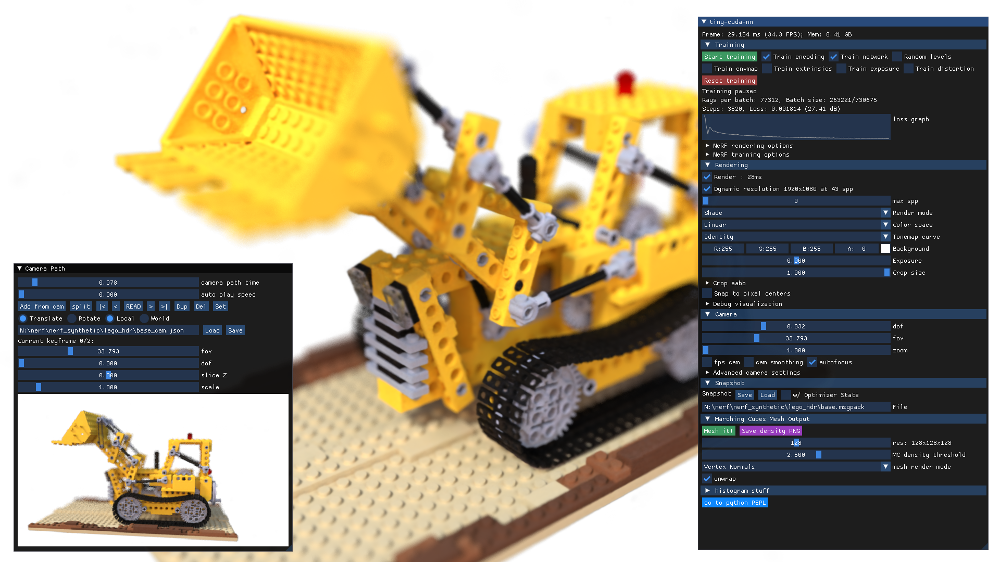
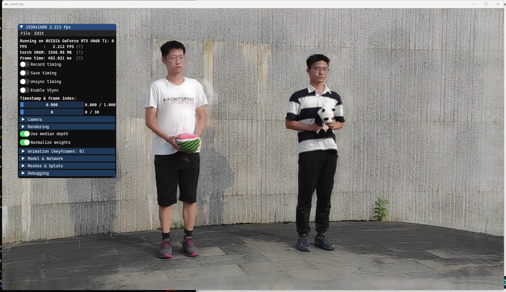
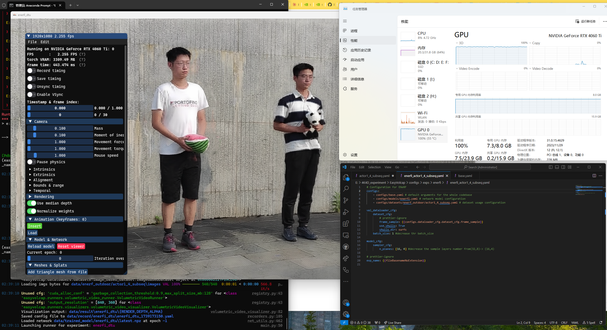

# The summary of EasyVolcap and 4DGS
## EasyVolcap 
In one word, EasyVolcap is a __Pytorch library__ for accelerating neural volumetric video research. 

In my words, __EasyVolcap__ is a __studio__ used for __4D Model__. Why I said like this, for the related research in 3D Model, __Nerfstudio__ is built for a simple process to finished end-to-end process of creating, training, and testing NeRFs and its related variants. The 3D model studio(Nerfstudio) is very friendly for 3D Model beginners as it modularize each component in GUI ways. The users can use all kinds of function by GUI interfaces. From the following gif, we can see the user set the specific path(red line) to view the whole 3D building model, and it also can adjust the camera view for specific users requirements. Compared to the original Nerf model, Nerf developers have to adjust the complex path code to get output. according to my experience, NerF just only provides the output with the fixed Spiral Upward Path for the input in the reconstruction process. It's also limited in the input order and fixed images size. Overall, Nerfstudios providers better and easier operations in modularizing each components with GUI.
 
For best understanding, I put one more example here, __instant-ngp__. we can get some inspiration when we using the EasyVolcap.

